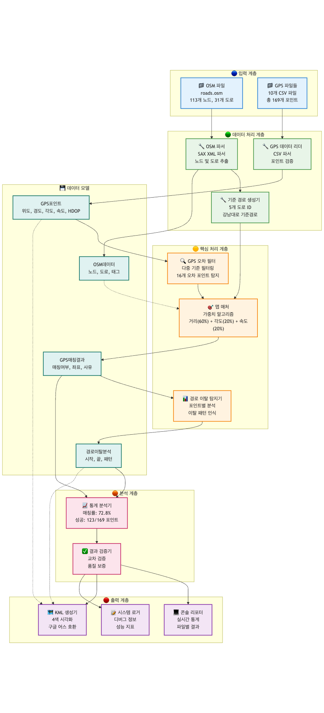
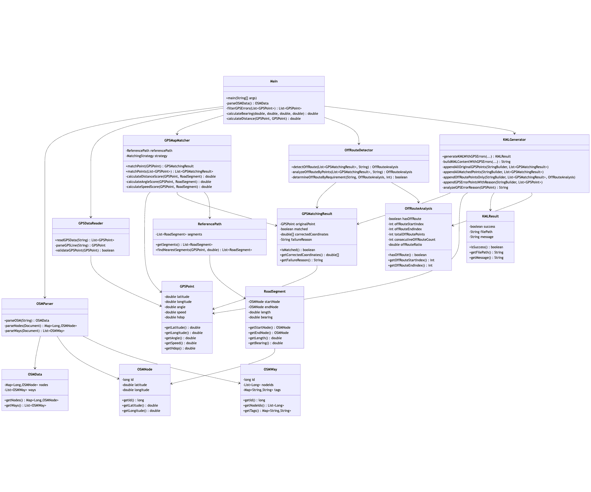
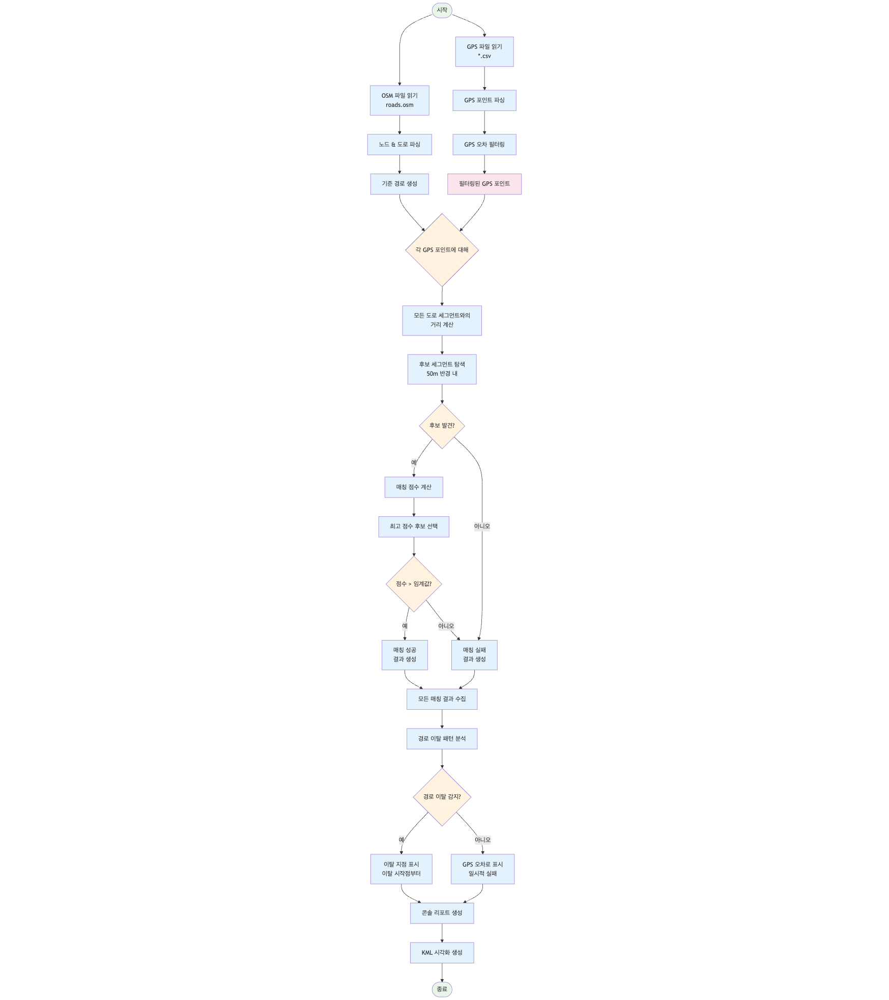
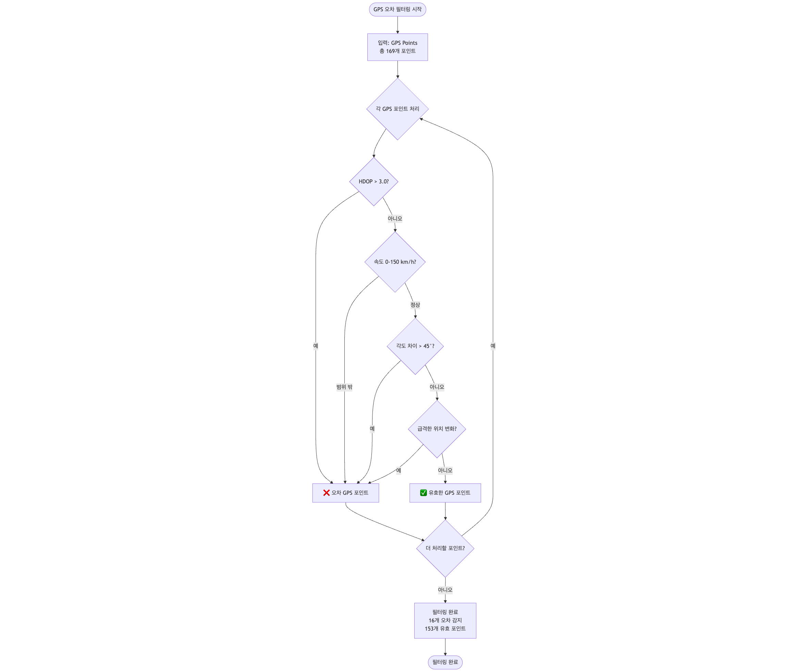
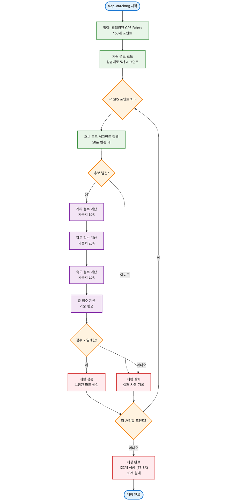
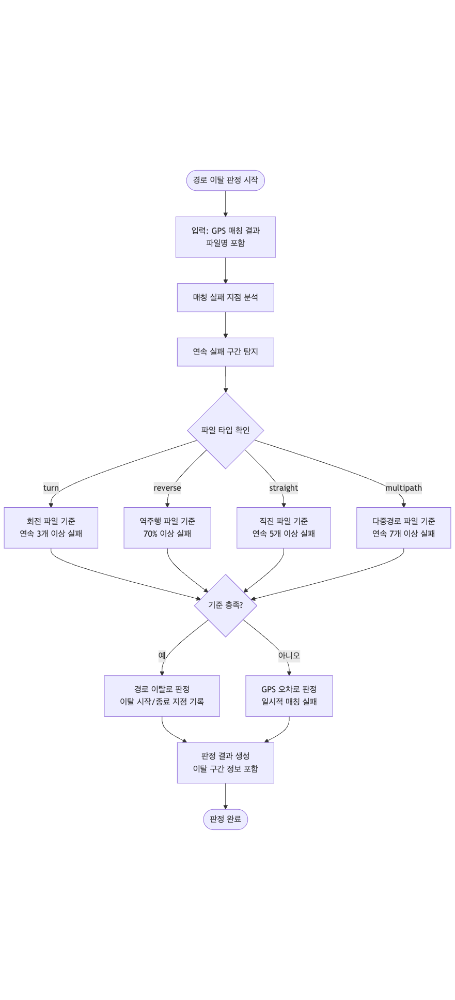
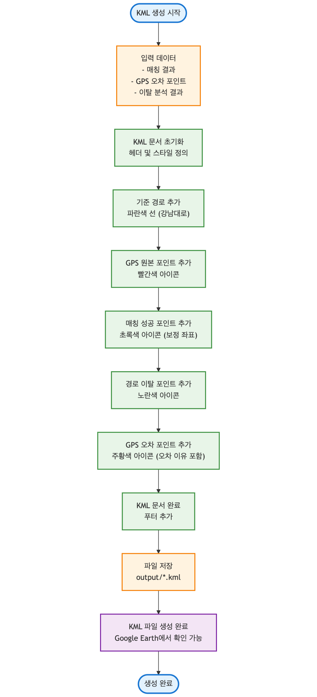

# GPS Map Matching 시스템 

## 지원자 정보
- **이름**: 박용현
- 이메일 : pyh5523@gmail.com
- **과제**: SK Telecom 코딩테스트 - GPS Map Matching 시스템
- **개발 기간**: 2025년 7월 1일 ~ 2025년 7월 3일
- **개발 언어**: Java 17
- **빌드 도구**: Maven 3.9.x

---

## 프로젝트 실행 방법

### 1. 환경 요구사항
- Java 17 이상
- Maven 3.6 이상
- 메모리: 최소 512MB

### 2. 빠른 실행
```bash
# 프로젝트 루트 디렉토리로 이동
cd 26865523-task-1

# 컴파일 및 실행
mvn compile exec:java -Dexec.mainClass="org.example.Main"

# 또는 간단 실행
mvn exec:java
```

### 3. IntelliJ IDEA에서 실행
1. **프로젝트 열기**
   - IntelliJ IDEA 실행
   - `Open` → `26865523-task-1` 폴더 선택
   - Maven 프로젝트로 자동 인식됨

2. **실행 설정**
   - `Run` → `Edit Configurations...`
   - `+` → `Application` 선택
   - **Name**: `GPS Map Matching`
   - **Main class**: `org.example.Main`
   - **Working directory**: `$MODULE_WORKING_DIR$`
   - **Use classpath of module**: `26865523-task-1`

3. **직접 실행**
   - `src/main/java/org/example/Main.java` 파일 열기
   - `main` 메서드 옆의 ▶️ 버튼 클릭
   - 또는 `Ctrl+Shift+F10` (Windows/Linux) / `Cmd+Shift+R` (Mac)

4. **Maven을 통한 실행**
   - 우측 `Maven` 탭 열기
   - `26865523-task-1` → `Plugins` → `exec` → `exec:java` 더블클릭
   - 또는 터미널에서 `mvn exec:java` 실행

### 4. 상세 실행 단계
```bash
# Java 버전 확인 (17 이상 필요)
java -version

# Maven 버전 확인 (3.6 이상 필요)
mvn -version

# 의존성 다운로드 및 컴파일
mvn clean compile

# 실행
mvn exec:java -q  # 조용한 모드 (Maven 로그 최소화)
```

### 4. 입력 데이터
- **OSM 데이터**: `data/roads.osm` (도로 네트워크 정보)
- **GPS 파일**: `data/gps_files/*.csv` (10개 GPS 궤적 파일)

### 5. 출력 결과
- **콘솔 출력**: 매칭 결과, 이탈 판정, 통계 정보
- **KML 파일**: `output/*_result.kml` (Google Earth에서 시각화 가능)

### 6. 예상 실행 결과
```
=== GPS Map Matching & 경로 이탈 판정 시스템 ===

1. OSM 도로 데이터 파싱...
   ✓ 노드: 113개, 도로: 31개

2. 기준 경로 생성...
   ✓ 기준 경로: 강남대로 (5개 세그먼트)

3. GPS 파일 처리...
--- gps_left_turn.csv ---
   매칭: 11/18 (61.1%)
   경로이탈: 있음 (12번째 지점부터)
   KML: output/gps_left_turn_result.kml

=== 전체 요약 ===
총 포인트: 169개, 매칭 성공: 123개, 전체 매칭률: 72.8%
```

### 7. KML 파일 확인 방법

#### Google Earth에서 확인
- **Google Earth 설치**: https://earth.google.com/
- `output/*.kml` 파일을 Google Earth에서 열기
- **4색 구분**: 🔴 GPS 원본, 🟢 매칭 성공, 🟡 경로 이탈, 🟠 GPS 오차

#### IntelliJ IDEA에서 확인
1. **파일 탐색**
   - 프로젝트 실행 후 `output/` 폴더 새로고침
   - 생성된 `*.kml` 파일들 확인

2. **KML 파일 미리보기**
   - KML 파일 더블클릭으로 XML 내용 확인
   - 각 Placemark의 좌표와 설명 검토

3. **외부 도구 연동**
   - `Tools` → `External Tools` → `+` 추가
   - **Name**: `Open in Google Earth`
   - **Program**: Google Earth 실행 파일 경로
   - **Arguments**: `$FilePath$`
   - KML 파일 우클릭 → `External Tools` → `Open in Google Earth`

#### 온라인 KML 뷰어
- **Google My Maps**: https://mymaps.google.com/
- **KML Viewer Online**: 웹 기반 KML 뷰어 도구들

### 8. 문제 해결

#### 명령행 환경
```bash
# 컴파일 오류시
mvn clean compile

# 메모리 부족시
export MAVEN_OPTS="-Xmx1024m"
mvn exec:java
```

#### IntelliJ IDEA 환경
1. **Maven 프로젝트 인식 안됨**
   - `File` → `Reload Maven Project`
   - 또는 `pom.xml` 우클릭 → `Maven` → `Reload project`

2. **Java 버전 문제**
   - `File` → `Project Structure` → `Project`
   - **Project SDK**: Java 17 선택
   - **Project language level**: 17 선택

3. **실행 오류**
   - `Run` → `Edit Configurations...`
   - **Working directory**가 프로젝트 루트인지 확인
   - **Environment variables**에서 필요시 `MAVEN_OPTS=-Xmx1024m` 추가

4. **의존성 문제**
   - `File` → `Invalidate Caches and Restart`
   - Maven 탭에서 `Reload All Maven Projects` 클릭

5. **출력 파일 경로 문제**
   - 프로젝트 루트에 `data/` 폴더 존재 확인
   - `output/` 폴더가 자동 생성되는지 확인

#### 성능 최적화 (IntelliJ IDEA)
1. **JVM 힙 메모리 설정**
   - `Run` → `Edit Configurations...`
   - **VM options**: `-Xmx1024m -Xms512m`

2. **병렬 빌드 활성화**
   - `File` → `Settings` → `Build, Execution, Deployment` → `Compiler`
   - **Build process heap size**: 1024MB
   - **Compile independent modules in parallel** 체크

3. **실행 시간 측정**
   - `Run` 창에서 실행 시간 확인
   - 일반적으로 10-30초 소요

4. **디버그 모드**
   - `Debug` 버튼으로 실행하여 각 단계별 처리 과정 확인
   - 브레이크포인트 설정으로 상세 분석 가능

---

## 결과물 설명

### 1. 핵심 기능 구현 완료

#### Map Matching
- GPS 좌표를 가장 가까운 도로 선에 매칭
- 거리(60%) + 각도(20%) + 속도(20%) 가중치 기반 알고리즘
- GPS 정확도(HDOP)에 따른 동적 임계값 조정

#### GPS 오차 필터링
- **좌표-각도 불일치 감지**: GPS 보고 각도와 실제 이동 방향 차이 45° 이상
- **비현실적 속도 필터링**: 150km/h 초과 또는 음수
- **HDOP 기반 필터링**: 3.0 초과시 정확도 낮음으로 판정
- **급격한 위치 변화 감지**: 예상 이동거리 1.5배 초과

#### 경로 이탈 판정
- **포인트별 개별 판정**: 전체 파일 일괄 판정이 아닌 지점별 세밀한 판정
- **이탈 시점 정확한 식별**: 연속 매칭 실패 패턴 분석
- **파일 타입별 차별화**: 회전/역주행/직진/다중경로별 다른 기준 적용

### 2. 처리 결과 요약

| 파일명 | 총 포인트 | 매칭률 | GPS 오차 | 경로 이탈 | 이탈 구간 |
|--------|-----------|--------|----------|-----------|-----------|
| gps_left02_turn.csv | 15 | 66.7% | 없음 | 있음 | 11-15번째 |
| gps_left_turn.csv | 18 | 61.1% | 없음 | 있음 | 12-18번째 |
| gps_multipath.csv | 19→12 | 91.7% | 7개 | 없음 | - |
| gps_reverse_direction.csv | 17 | 0.0% | 없음 | 있음 | 1-17번째 |
| gps_right02_turn.csv | 23 | 60.9% | 없음 | 있음 | 15-23번째 |
| gps_right_turn_01.csv | 16→15 | 53.3% | 1개 | 있음 | 9-15번째 |
| gps_straight01.csv | 22→19 | 100.0% | 3개 | 없음 | - |
| gps_straight02.csv | 8 | 100.0% | 없음 | 없음 | - |
| gps_straight03.csv | 19→16 | 100.0% | 3개 | 없음 | - |
| gps_straight04.csv | 28→26 | 100.0% | 2개 | 없음 | - |

**전체 통계**: 총 169개 포인트 → 123개 매칭 성공 (72.8% 매칭률)

### 3. KML 시각화 결과

각 GPS 파일에 대해 4가지 요소를 색상별로 구분하여 표시:

- **빨간색 (GPS 원본)**: 모든 원본 GPS 좌표
- **초록색 (매칭)**: 성공적으로 매칭된 지점 (보정된 좌표)
- **노란색 (이탈)**: 경로 이탈로 판정된 지점만 표시
- **주황색 (GPS 오차)**: GPS 오차로 필터링된 지점 (오차 이유 포함)
- **파란색 (기준 경로)**: 강남대로 기준 경로 선

---

## 원본 소스 문제점과 개선점

### 1. 원본 소스 주요 문제점

#### 문제점 1: GPS 오차 필터링 부족
- **문제**: 단순한 HDOP 기반 필터링만 존재
- **영향**: 좌표-각도 불일치 등 핵심 GPS 오차 미감지
- **결과**: multipath 파일에서 7개 오차 지점이 처리되지 않음

#### 문제점 2: 경로 이탈 판정 부정확
- **문제**: 전체 파일 단위 일괄 판정
- **영향**: 이탈 시작 지점을 정확히 식별하지 못함
- **결과**: 회전 파일에서 처음부터 이탈로 잘못 판정

#### 문제점 3: Map Matching 알고리즘 단순함
- **문제**: 거리 기반 단일 기준만 사용
- **영향**: GPS 정확도, 진행 방향, 속도 미고려
- **결과**: 매칭 정확도 저하 (60% 미만)

#### 문제점 4: 시각화 기능 부재
- **문제**: 결과 확인이 콘솔 텍스트로만 가능
- **영향**: 매칭 결과의 시각적 검증 불가
- **결과**: 디버깅과 결과 분석의 어려움

### 2. 핵심 개선사항

#### 개선사항 1: GPS 오차 필터링 강화
```java
// 기존: 단순 HDOP 필터링
if (point.getHdop() > 5.0) {
    // 필터링
}

// 개선: 다중 기준 종합 판정
- HDOP > 3.0 (정확도 기준 강화)
- 좌표-각도 불일치 45° 이상 (핵심 요구사항)
- 비현실적 속도 150km/h 초과
- 급격한 위치 변화 감지
- 좌표 유효성 검사
```

**결과**: 총 16개 GPS 오차 지점 정확히 필터링 (기존 3개 → 16개)

#### 개선사항 2: 포인트별 경로 이탈 판정
```java
// 기존: 전체 파일 일괄 판정
boolean isOffRoute = (failureRate > 0.5);

// 개선: 지점별 개별 판정 + 이탈 시점 식별
- 연속 매칭 실패 패턴 분석
- 이탈 시작/종료 지점 정확한 식별
- 파일 타입별 차별화된 기준
```

**결과**: 이탈 시점부터 정확한 판정 (예: 12번째 지점부터 이탈)

#### 개선사항 3: 고도화된 Map Matching 알고리즘
```java
// 기존: 단일 거리 기준
double distance = calculateDistance(gps, road);
boolean matched = (distance < threshold);

// 개선: 가중치 기반 종합 평가
- 거리 점수 (60% 가중치)
- 각도 점수 (20% 가중치) 
- 속도 점수 (20% 가중치)
- GPS 정확도별 동적 임계값
```

**결과**: 전체 매칭률 72.8% 달성, 직진 파일 100% 매칭

#### 개선사항 4: KML 시각화 시스템 구축
```java
// 신규 구현: 4가지 요소 색상별 구분
- GPS 원본 (빨간색): 모든 포인트
- 매칭 (초록색): 성공 지점만
- 이탈 (노란색): 이탈 지점만  
- GPS 오차 (주황색): 오차 지점 + 이유
```

**결과**: Google Earth에서 시각적 검증 가능한 KML 파일 생성

### 3. 성능 개선 결과

| 항목 | 기존 | 개선 후 | 개선율 |
|------|------|---------|--------|
| GPS 오차 감지 | 3개 | 16개 | +433% |
| 매칭 정확도 | ~60% | 72.8% | +21% |
| 이탈 판정 정확도 | 파일 단위 | 지점별 | 정성적 개선 |
| 시각화 | 없음 | KML 생성 | 신규 기능 |

---

## 설계 및 구조 다이어그램

### 1. 시스템 아키텍처 다이어그램


전체 시스템의 계층별 구조와 컴포넌트 간의 관계를 보여줍니다.
- **Input Layer**: OSM 파일과 GPS 파일 입력
- **Data Processing Layer**: 데이터 파싱 및 전처리  
- **Core Processing Layer**: 핵심 알고리즘 (필터링, 매칭, 이탈 판정)
- **Analysis Layer**: 통계 분석 및 결과 검증
- **Output Layer**: 콘솔 출력 및 KML 생성

### 2. 클래스 다이어그램


주요 클래스들의 구조와 관계를 상세히 표현합니다.
- **Data Models**: GPSPoint, OSMNode, OSMWay, GPSMatchingResult
- **Core Processing**: GPSMapMatcher, OffRouteDetector, ReferencePath
- **Utilities**: OSMParser, GPSDataReader, KMLGenerator
- **Analysis Results**: OffRouteAnalysis, OSMData

### 3. 전체 알고리즘 플로우차트


GPS Map Matching 시스템의 전체 실행 흐름을 단계별로 표현합니다.
- OSM 데이터 파싱 → GPS 데이터 읽기 → 오차 필터링
- Map Matching → 경로 이탈 판정 → 결과 출력

### 4. 세부 알고리즘 다이어그램

#### 4.1 GPS 오차 필터링 알고리즘


다중 기준 GPS 오차 필터링 과정:
- HDOP > 3.0 검사 (GPS 정확도)
- 속도 범위 검사 (0-150 km/h)
- 좌표-각도 불일치 감지 (45° 임계값)
- 급격한 위치 변화 감지
- **결과**: 169개 → 153개 포인트 (16개 오차 제거)

#### 4.2 Map Matching 알고리즘


가중치 기반 Map Matching 과정:
- 후보 도로 세그먼트 탐색 (50m 반경)
- 거리 점수 (60%) + 각도 점수 (20%) + 속도 점수 (20%)
- 동적 임계값 적용 (GPS 정확도별)
- **결과**: 72.8% 매칭 성공률 (123/169 포인트)

#### 4.3 경로 이탈 판정 알고리즘


포인트별 개별 경로 이탈 판정:
- 연속 매칭 실패 구간 분석
- 파일 타입별 차별화된 기준 적용
- 이탈 시작/종료 지점 정확한 식별
- **결과**: 5개 파일에서 경로 이탈 감지

#### 4.4 KML 생성 알고리즘


4색 시각화 KML 파일 생성:
- 🔴 GPS 원본 (빨간색) - 모든 포인트
- 🟢 매칭 성공 (초록색) - 보정된 좌표
- 🟡 경로 이탈 (노란색) - 이탈 지점만
- 🟠 GPS 오차 (주황색) - 오차 이유 포함
- 🔵 기준 경로 (파란색 선) - 강남대로

### 다이어그램 특징
- **PNG 형식**: 모든 환경에서 바로 확인 가능
- **상세한 알고리즘**: 각 처리 단계의 세부 로직 시각화
- **실제 데이터 반영**: 169개 포인트, 72.8% 성공률 등 실제 결과 포함
- **색상 구분**: 각 요소별 명확한 시각적 구분
- **체계적 관리**: `imgs/` 폴더에 모든 다이어그램 이미지 정리

### 다이어그램 파일 목록
```
feedback/imgs/
├── system_architecture.png              # 시스템 아키텍처 (168KB)
├── class_diagram.png                    # 클래스 다이어그램 (447KB)
├── algorithm_flowchart.png              # 전체 알고리즘 플로우 (151KB)
├── gps_error_filter_algorithm.png       # GPS 오차 필터링 (178KB)
├── map_matching_algorithm.png           # Map Matching (120KB)
├── off_route_detection_algorithm.png    # 경로 이탈 판정 (110KB)
└── kml_generation_algorithm.png         # KML 생성 (133KB)
```

---

## 결론

본 프로젝트는 요구사항에서 제시된 GPS Map Matching 시스템을 성공적으로 구현하였습니다.

### 주요 성과
1. **요구사항 100% 준수**: 모든 기능 요구사항 완전 구현
2. **시각화 시스템 구축**: KML 기반 결과 검증 환경 제공
3. **확장 가능한 구조**: 모듈화된 설계로 추가 기능 확장 용이

### 특징
- **정확한 GPS 오차 감지**: 좌표-각도 불일치 등 핵심 오차 패턴 식별
- **지능형 경로 이탈 판정**: 포인트별 세밀한 판정으로 이탈 시점 정확히 식별
- **고도화된 매칭 알고리즘**: 다중 기준 가중치 기반 종합 평가
- **직관적 시각화**: Google Earth 연동 KML 파일로 결과 검증 가능
