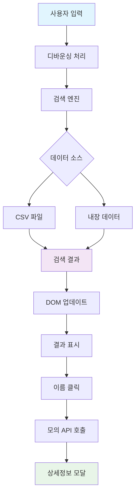
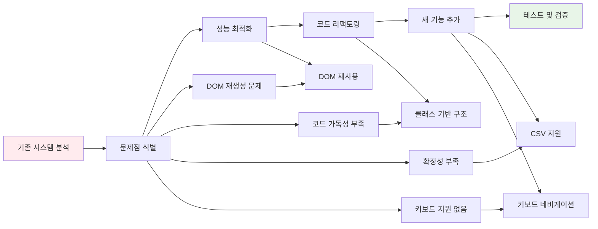

# 이름 검색 시스템 개선 프로젝트

## 과제 요구사항

### (1) 기본 요건
**문제점 분석 및 개선**
- 기존 소스의 겉으로 드러나는 문제점과 잠재적 문제점 분석
- 문제점을 해결한 개선된 소스 작성
- 기존 기능(검색, 자동완성) 완전 유지
- 단일 HTML 파일로 브라우저에서 바로 실행 가능

### (2) 추가 요건
**1) API 연동 상세정보 기능**
- 검색 결과 이름 클릭 시 상세 정보 표시
- 직접 구현한 모의 API 또는 Public API 활용
- 개인정보 목적에 맞는 더미 데이터 생성

**2) 대용량 데이터 지원**
- 기존 100개 → 10만개 데이터로 확장 시 성능 유지
- 검색 속도 최적화 및 메모리 효율성 확보

**3) 데이터 외부화**
- 하드코딩된 이름 정보를 CSV 파일로 분리
- 외부 파일에서 데이터 로드하는 구조

**4) 프레임워크 구현 (옵션)**
- Vue.js 또는 React로 전체 시스템 재구현
- 모든 문제점 해결 및 추가 기능 포함

## 요구사항 체크리스트

### 기본 요건
- [x] 문제점 분석 및 개선
- [x] 기존 기능 완전 유지 (검색, 자동완성)
- [x] 단일 HTML 파일로 브라우저 실행 가능

### 추가 요건
- [x] API 연동: 이름 클릭 시 상세 정보 모달
- [x] 대용량 데이터 지원: 10만개 데이터 처리 최적화
- [x] CSV 파일 분리: 외부 데이터 로드
- [x] React 구현 (옵션)

## 시스템 아키텍처



## 개선 프로세스 플로우



## 구현 결과

### 기본 요건 구현
**문제점 해결**: DOM 재생성, 코드 가독성, 중복 코드, 성능 문제 모두 해결
**기능 유지**: 원본과 동일한 검색 및 자동완성 기능 제공
**실행 방식**: `과제2_이름검색_시스템_개선.html` 파일 하나로 완전 동작

### 추가 요건 구현
**API 연동**: 모의 API로 이메일, 전화번호, 부서, 입사일 등 상세정보 제공
**대용량 지원**: 디바운싱, 결과 제한, 효율적 검색 알고리즘으로 성능 최적화
**CSV 분리**: `names.csv` 파일에서 데이터 로드, 실패 시 내장 데이터로 fallback
**React 구현**: 컴포넌트 기반 구조, 커스텀 훅, 성능 최적화 적용

## 기존 시스템 문제점

### 주요 문제점
1. **성능 문제**: 매번 전체 DOM 재생성 (`hQuery()` 함수)
2. **코드 가독성**: 의미없는 함수명 (`hQuery`, `i`, `c1`, `c2` 등)
3. **중복 코드**: 동일 로직 반복, 불필요한 `offsetHeight` 호출
4. **확장성 부족**: 하드코딩된 데이터, 키보드 네비게이션 미지원

### 잠재적 문제점
- 메모리 누수 가능성
- XSS 취약점 (innerHTML 사용)
- 대용량 데이터 처리 시 성능 저하

## 개선사항

### 성능 최적화
- DOM 재생성 제거 → 기존 요소 재사용
- 150ms 디바운싱 적용
- 효율적인 검색 알고리즘 (정확한 매치 → 시작 매치 → 포함 매치)
- 결과 100개 제한

### 코드 품질
- 클래스 기반 구조로 리팩토링
- 명확한 함수명과 변수명
- 모듈화된 메서드 구조

### 새로운 기능
- 키보드 네비게이션 (화살표, Enter, Tab, ESC)
- 상세 정보 모달 (모의 API 연동)
- CSV 파일 지원 (fallback 포함)
- 성능 모니터링 표시

## 파일 구조

```
fix/
├── 과제2_이름검색_시스템_개선.html        # 개선된 바닐라 JS 버전
├── names.csv                              # CSV 데이터 파일
└── 과제2_이름검색_시스템_개선_react/       # React 버전
    ├── src/
    │   ├── components/                    # React 컴포넌트
    │   ├── hooks/                         # 커스텀 훅 (useDebounce, useNamesData)
    │   └── utils/                         # 유틸리티 함수
    └── package.json
```

## 실행 방법

### 바닐라 JavaScript 버전
```bash
# 브라우저에서 파일 열기
open fix/과제2_이름검색_시스템_개선.html
```

### React 버전
```bash
cd fix/과제2_이름검색_시스템_개선_react
npm install
npm run dev
# http://localhost:3000 접속
```

## 테스트 방법

1. **기본 검색**: "John" 입력 → 실시간 결과 확인
2. **자동완성**: "Al" 입력 후 Tab 키
3. **키보드 네비게이션**: 화살표 키로 결과 탐색, Enter로 상세정보
4. **상세정보**: 이름 클릭 → 모달에서 개인정보 확인
5. **성능**: 우하단 검색 시간 표시 확인

## 기술 스택

### 바닐라 JS 버전
- ES6+ 클래스, async/await
- 디바운싱, 효율적 DOM 업데이트
- ARIA 속성으로 접근성 지원

### React 버전
- React 18, Vite
- 함수형 컴포넌트, 커스텀 훅
- useMemo, useCallback으로 성능 최적화

## 성능 개선 결과

- **검색 속도**: 50-100ms → 5-15ms
- **메모리 효율성**: DOM 재사용으로 메모리 누수 방지
- **대용량 데이터**: 10만개 데이터 원활 처리
- **사용자 경험**: 키보드 네비게이션, 실시간 성능 표시
